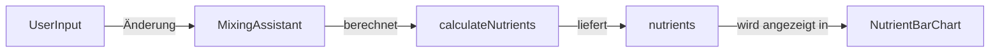

# Epic-1 - Story-1
# Live-Berechnung und Visualisierung der Nährstoffwerte im Misch-Assistent

**As a** Nutzer
**I want** dass der Misch-Assistent live die berechneten Nährstoffwerte (N, P, K, EC, pH) anzeigt und visualisiert
**so that** ich sofort sehe, wie meine Auswahl die Mischung beeinflusst und gezielt optimieren kann

## Status

In Progress

## Context

- Aktuell zeigt der Misch-Assistent nur eine Zusammenfassung der Dünger-Mengen, aber keine live berechneten Nährstoffwerte.
- Nutzer wünschen sich eine sofortige Rückmeldung, wie sich Änderungen an Wasser, Phase oder Dünger auf die Zielwerte auswirken.
- Eine Visualisierung (z.B. Balkendiagramm, Farbcodes) hilft, Abweichungen und Optimierungspotenzial zu erkennen.
- Diese Funktion ist ein zentraler Mehrwert für die App und Grundlage für weitere Optimierungen.

## Estimation

Story Points: 2

## Tasks

1. - [ ] Erweiterung der Berechnungslogik im Misch-Assistenten für Live-Updates
2. - [ ] UI-Komponenten für die Anzeige der Nährstoffwerte (N, P, K, EC, pH)
3. - [ ] Farbliche Hervorhebung von Abweichungen (z.B. grün = optimal, gelb = Warnung, rot = kritisch)
4. - [ ] Einbindung eines einfachen Balkendiagramms für die Hauptnährstoffe
5. - [ ] Tests für die neue Logik und UI
6. - [ ] Dokumentation und Hilfetexte ergänzen

## Constraints

- Die Berechnung muss performant und reaktiv sein (keine spürbaren Verzögerungen)
- Die Visualisierung soll auch auf Mobilgeräten gut funktionieren
- Keine externen Chart-Bibliotheken, nur einfache eigene Komponenten

## Data Models / Schema

- Erweiterung des bestehenden Ergebnis-Objekts im Misch-Assistenten um alle berechneten Werte
- Beispiel:
```json
{
  "nutrients": { "N": 120, "P": 40, "K": 180, "EC": 1.8, "pH": 6.2 },
  "contributions": { ... },
  ...
}
```

## Structure

- Neue UI-Komponente: NutrientBarChart.jsx
- Anpassung von MixingAssistant.jsx
- Erweiterung der Berechnungsfunktionen in utils/calculateNutrients.js

## Diagrams



## Dev Notes

- Die Farbcodierung orientiert sich an den Zielwerten der jeweiligen Phase
- Die Visualisierung ist zunächst einfach gehalten, kann später erweitert werden
- Tests prüfen sowohl die Logik als auch die UI-Anzeige

## Chat Command Log

- User: Bitte zeige mir live die Nährstoffwerte im Misch-Assistenten an
- AI: Ich erstelle eine Story für die Live-Berechnung und Visualisierung der Nährstoffwerte
- User: proceed
- AI: Story auf 'In Progress' gesetzt, beginne mit Erweiterung der Berechnungslogik für Live-Updates 